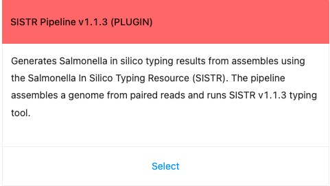
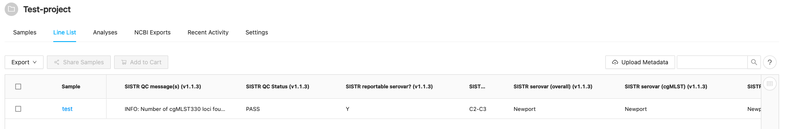
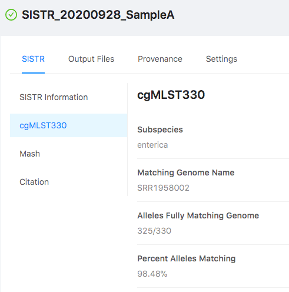

 # IRIDA SISTR Plugin for Salmonella serotyping
This new IRIDA plugin allows deployment of SISTR, a tool for *in silico Salmonella* serotyping, in IRIDA platform. For faster and independent updates, SISTR built-in workflow were decided to be ported to plugin format. 

# Features
* Uses the newest features of the SISTR v1.1.3 including updated nomenclature for O24 and O25 antigens
* Check if SISTR predicted serovar is in the version 5 list of reportable serovars (https://github.com/phac-nml/sistr_cmd/blob/v1.1.3/sistr/data/serovar-list.txt)

# Building plugin
Compiled plugin version is available in [`*.jar` folder](/jar/), but you can build your own copy. Building and packaging this code is accomplished using [Apache Maven](http://maven.apache.org/download.cgi). However, you will first need to install [IRIDA](https://github.com/phac-nml/irida) to your local Maven repository. The version of IRIDA you install will have to correspond to the version found in the `irida.version.compiletime` property in the `pom.xml` file of this project. To build successfully plugin there is a need to compile IRIDA corresponding to the version specified in `pom.xml`. 
Here is a brief workflow to compile new `*.jar` file from the source code 

```bash
IRIDA_VERSION=22.05
# Build IRIDA dependencies
git clone https://github.com/phac-nml/irida.git
git checkout ${IRIDA_VERSION}
#IRIDA dependencies will be located in ~/.m2
mvn install -DskipTests 
git clone https://github.com/phac-nml/irida-plugin-sistr.git
cd irida-plugin-sistr
# Build ECTyper plugin
mvn package -DskipTests  #find your package in /target
# move to *.jar to /etc/irida/plugins/
```
Below you will find more detailed explanations of each step above.

# Install
As most IRIDA plugins, this plugin is readily installable by the placement of the [`*.jar` file](/jar/) in `/etc/irida/plugins` directory. After IRIDA server restart, the new pipeline should appear in the list of pipelines. 


# Dependencies

The following dependencies are required to make and run this plugin.

* IRIDA >= 19.01.3, <= 24.12 (analysis report rendering feature requires >= 20.09)
* Java == 11 and Maven >= 3.6.3 (to build IRIDA source code dependencies)
* Galaxy >= 16.01
* Shovill == 1.1.0
* SISTR == 1.1.3

# Galaxy configuration
The plugin assumes a properly configured Galaxy instance that will run the workflow included in the plugin.
For this version of the plugin, the backend Galaxy instance needs to have the following tools installed via the `Admin` interface.

* Shovill v1.1.0
	* version 1.1.0
  	* revision 6:83ead2be47b2
  	* published 2020-07-03
  	* [ToolShed direct link](https://toolshed.g2.bx.psu.edu/repos/iuc/shovill/shovill/1.1.0+galaxy0)

  
* SISTR v1.1.3
	* version 1.1.3
	* revision 6:cf767360ede1
	* published 2024-12-30
	* [ToolShed direct link](https://toolshed.g2.bx.psu.edu/view/nml/sistr_cmd/cf767360ede1)

# Gallery
A couple of illustrations demonstrating plugin in action.

# Feature updates
* inclusion of the following new fields in the IRIDA Project `Line List` output
	* `cgmlst_found_loci`
	* `serovar_antigen`
	* `mash_serovar`
	* `mash_subspecies`
	* `cgmlst_genome_match`
	* `mash_genome`
	* `mash_distance`
	* `qc_messages`
	* `predicted_serovar_in_list`
* update to the newest `shovill` version `1.1.0` with more relaxed assembly setting with minimum contig length of 1 bp


### Automatic metadata population
The plugin allows for automatic IRIDA project metadata population and automatic triggering upon sequencing data upload. These features need to be updated in the IRIDA project configuration page. Make sure to select on `Save the SISTR generated data (serovar, antigens, etc.) to the project metadata (i.e. Line List tab)? (recommended)` on the parameters screen when launching the pipeline.

<p align="center">
  
</p>
<p align="center" style="font-style:bold;font-size: 20px"><b>Figure 1:</b> Pipeline Tile</p>

<p align="center">
  
</p>
<br>
<p align="center" style="font-style:bold;font-size: 20px"><b>Figure 2:</b> Key metadata fields populated after serotyping run</p>
<p align="center"></p>
<br>
<p align="center">
  
</p>
<br>
<p align="center" style="font-style:bold;font-size: 20px"><b>Figure 3:</b> Serotyping results rendered by SISTR Viewer into a pretty web-page</p>
<p align="center"></p>


### Troubleshooting
After successful installation, plugin should appear in the list of available pipelines. If not, check web-server log files for errors (e.g. Tomcat 7 logs `/var/log/tomcat7/catalina.out`)


### Testing
Folder `sampledata` has
* stripped versions of the `Salmonella Newport` raw reads from [SRR12168692](https://www.ncbi.nlm.nih.gov/sra/SRR12168692) accession. These files could be used to test plugin in your IRIDA instance
* `SISTR_results.json` example results file output by the tool 


